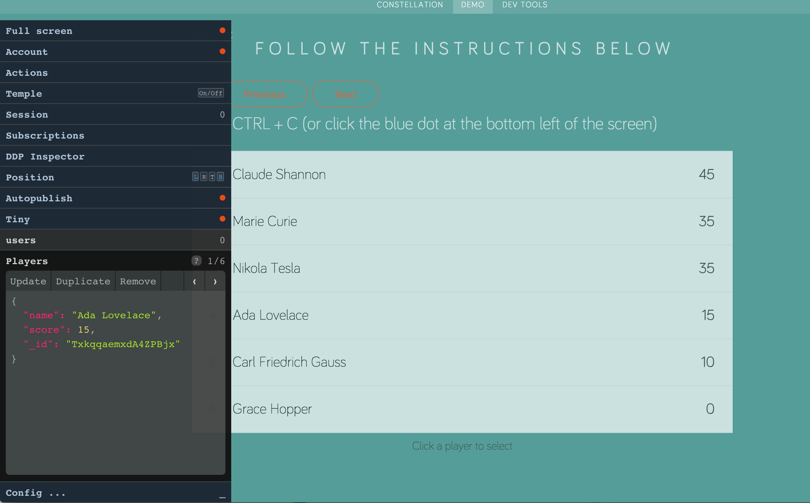

# Curated distro for [Constellation](https://atmospherejs.com/constellation/console)
###### **Constellation** is an extensible dev console for Meteor



### Installation

`meteor add babrahams:constellation`

### Demo

[Constellation demo site](http://constellation-demo.meteor.com/demo) that steps you through basic use of most the packages included in this distro

### What you get

###### This distro includes the constellation base functionality:

- interface for inserting, updating, removing documents in **Mongo collections** (one tab for each collection)
- tab with an __actions log and undo/redo__ for any changes to documents made through the Constellation console
- __account tab__ showing the current signed in user and also for __impersonating__ other users
- __fullscreen__ switch
- __config__ tab for hiding and showing any tabs in the console

###### It also includes packages for the following optional extra tabs:

- "Temple" - a tab that gives you a visual look behind the scenes at your app's __templates and their data contexts__
- a tab that shows the current __subscriptions__ and the parameters used when subscribing
- __autopublish__ switch
- a tab where you can __manipulate `Session` keys and values__ (along with other ReactiveDict instances in the global scope)
- toggle __console size__ (make it tiny)
- __position the console__ left/right, up/down (in case it's covering the wrong part of your app)

###### Not included, but may be of use to you

- [Velocity](https://atmospherejs.com/constellation/velocity) HTML reporter in your Constellation console
- ["DDP Inspector"](https://atmospherejs.com/lai/ddp-inspector) - for keeping an eye on the data flow between client and server
- [Schema](https://atmospherejs.com/constellation/schema) generator - when typing out your schema gets too onerous

### Notes 

- This package just includes other packages.
- You can achieve the same effect as adding this package by adding individual packages from atmosphere. The following command will achieve a _similar_ result to adding this package:
```
meteor add constellation:console constellation:subscriptions constellation:autopublish constellation:session constellation:tiny constellation:position babrahams:temple lai:ddp-inspector
```

###### Advantages of using a distro like this

- __easy install:__ `meteor add babrahams:constellation`
- __no clutter:__ when you type `meteor list` - you don't see a whole lot of Constellation-related packages, just `babrahams:constellation`

###### Disadvantages of using a distro like this

- you __can't remove individual packages__ - i.e. you lose the ability to remove constellation tabs from the command line, although you can always hide tabs you don't want using the "Config ..." panel
- we don't really want a whole lot of distros like this __cluttering Atmosphere__, but I thought there should be one curated package that gives you most of the useful Constellation functionality out of the box
- `meteor update` isn't going to get you the __latest individual package versions__ unless this distro is up to date (if its not, open an issue!)

### Alternative approach to installation and configuration

To get a clean `meteor list` but more control over which packages are included in your Constellation console:

1. Clone this repo into your app's `/packages` directory
2. `meteor add babrahams:constellation`
3. Open `package.js` and
  - remove lines such as `api.use('constellation:tiny@0.3.0');` if you never want to use the "Tiny" tab
  - add lines such as `api.use('constellation:velocity@0.3.0');` if you want to use the "Velocity" tab
  
__Note:__ If you do this, you're on you own with regards to package version management!
